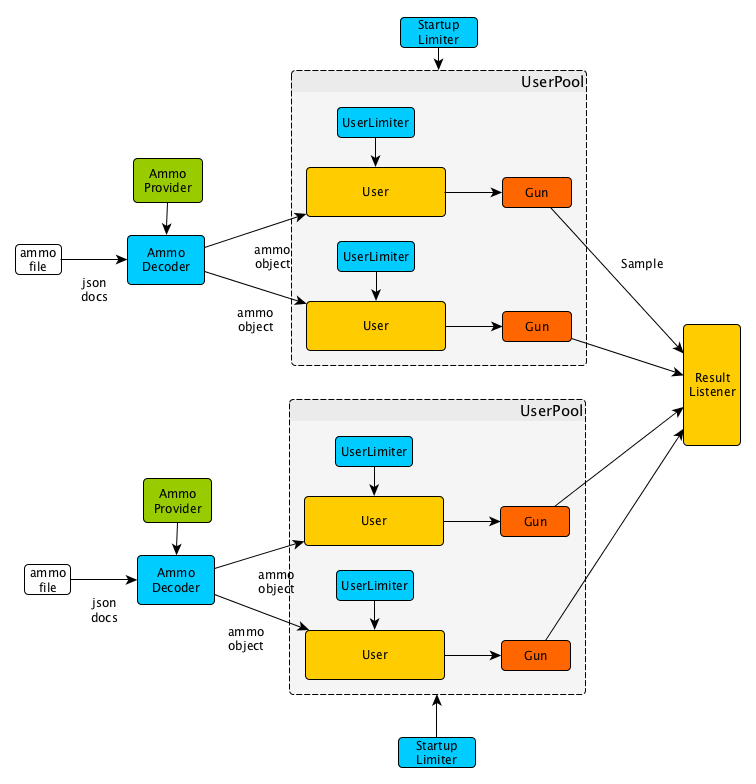

Architectural overview
======================

Architectural scheme
--------------------

You can download architectural scheme source `here <architecture.graphml>`_. Open it with `YeD <https://www.yworks.com/en/products/yfiles/yed/>`_ editor.

Pandora is a set of components talking to each other through Go channels. There are different types of components.

Component types
---------------

Ammo Provider
+++++++++++++

Ammo Provider knows how to make an ammo object from an ammo file or other external resource. Instances get ammo objects
from Ammo Provider.

Instances Pool
++++++++++++++

Instances Pool manages the creation of Instances. You can think of one Instance as a single user that sends requests to
a server sequentially. All Instances from one Instances Pool get their ammo from one Ammo Provider. Instances creation
times are controlled by Startup Scheduler. All Instances from one Instances Pool also have Guns of the same type.

Scheduler
+++++++++

Scheduler controls other events' times by pushing messages to its underlying channel according to the Schedule.
It can control Instances startup times, RPS amount (requests per second) or other processes.

By combining two types of Schedulers, RPS Scheduler and Instance Startup Scheduler, you can simulate different types of load.
Instace Startup Scheduler controls the level of parallelism and RPS Scheduler controls throughput.

If you set RPS Scheduler to 'unlimited' and then gradually raise the number of Instances in your system by using Instance
Startup Scheduler, you'll be able to study the `scalability <http://www.perfdynamics.com/Manifesto/USLscalability.html>`_
of your service. 

If you set Instances count to a big, unchanged value (you can estimate the needed amount by using
`Little's Law <https://en.wikipedia.org/wiki/Little%27s_law>`_) and then gradually raise the RPS by using RPS Scheduler,
you'll be able to simulate Internet and push your service to its limits.

You can also combine two methods mentioned above. And, one more thing, RPS Scheduler can control a whole Instances Pool or
each Instance individually.

Instances and Guns
++++++++++++++++++

Instances takes an ammo, waits for a Scheduler tick and then shoots with a Gun it has. Gun is a tool that sends
a request to your service and measures the parameters (time, error codes, etc.) of the response.

Aggregator
++++++++++

Aggregator collects measured samples and saves them somewhere.