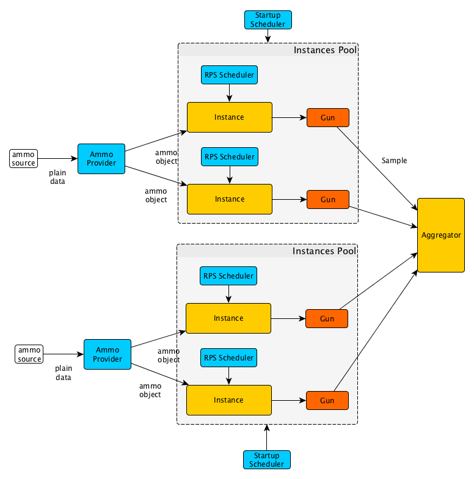

[Home](../index.md)

---

# Architectural overview 

- [Architectural scheme](#architectural-scheme)
- [Component types](#component-types)
  - [Ammo Provider](#ammo-provider)
  - [Instances Pool](#instances-pool)
  - [Scheduler](#scheduler)
  - [Instances and Guns](#instances-and-guns)
  - [Aggregator](#aggregator)

## Architectural scheme

You can download architectural scheme source [here](../images/architecture.graphml).
Open it with [YeD](https://www.yworks.com/en/products/yfiles/yed/) editor.

Pandora is a set of components talking to each other through Go channels. There are different types of components.

## Component types

### Ammo Provider

Ammo Provider knows how to make an ammo object from an ammo file or other external resource. Instances get ammo objects
from Ammo Provider.

### Instance Pool

Instance Pool manages the creation of Instances. You can think of one Instance as a single user that sends requests to a server sequentially. All Instances from one Instance Pool get their ammo from one Ammo Provider. Instances creation times are controlled by Startup Scheduler. All Instances from one Instance Pool also have Guns of the same type.

### Scheduler

Scheduler controls other events' times by pushing messages to its underlying channel according to the Schedule.
It can control Instances startup times, RPS amount (requests per second) or other processes.

By combining two types of Schedulers, RPS Scheduler and Instance Startup Scheduler, you can simulate different types of
load.
Instace Startup Scheduler controls the level of parallelism and RPS Scheduler controls throughput.

RPS Scheduler can limit throughput of a whole instances pool, i.e. 10 RPS on 10 instances means 10 RPS overall, or
limit throughput of each instance in a pool individually, i.e. 10 RPS on each of 10 instances means 100 RPS overall.

If you set RPS Scheduler to 'unlimited' and then gradually raise the number of Instances in your system by using
Instance
Startup Scheduler, you'll be able to study
the [scalability](http://www.perfdynamics.com/Manifesto/USLscalability.html)
of your service.

If you set Instances count to a big, unchanged value (you can estimate the needed amount by using
[Little's Law](https://en.wikipedia.org/wiki/Little%27s_law)) and then gradually raise the RPS by using RPS Scheduler,
you'll be able to simulate Internet and push your service to its limits.

You can also combine two methods mentioned above.

### Instances and Guns

Instances takes an ammo, waits for a Scheduler tick and then shoots with a Gun it has. Gun is a tool that sends
a request to your service and measures the parameters (time, error codes, etc.) of the response.

### Aggregator

Aggregator collects measured samples and saves them somewhere.

---

[Home](../index.md)