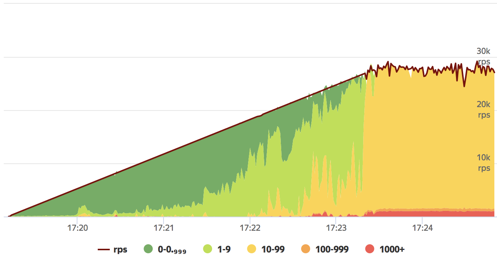
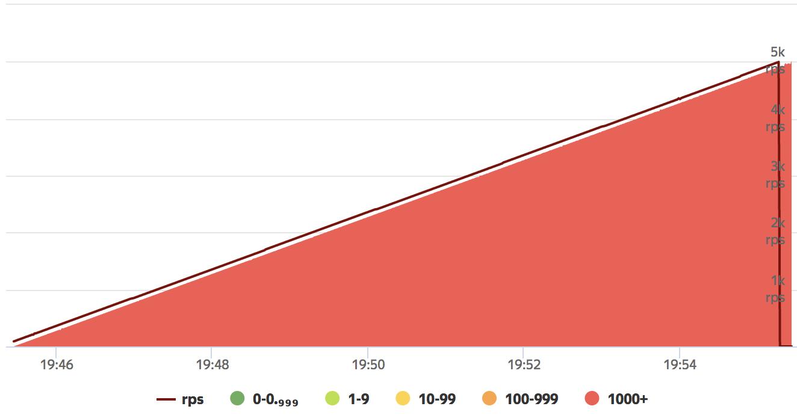
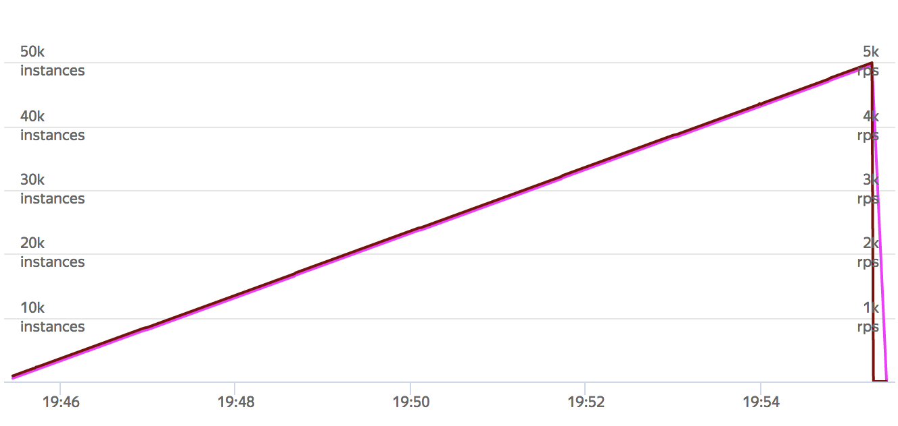
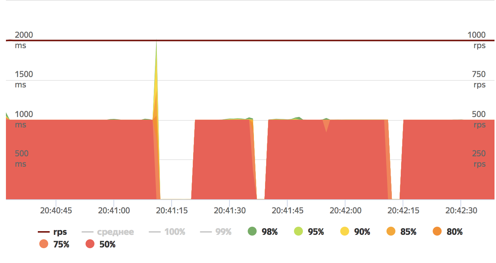

[Home](../index.md)

---

# Pandora's performance

- [HTTP requests to nginx](#http-requests-to-nginx)
- [Custom scenarios](#custom-scenarios)

[Alexander Ivanov](mailto:ival.net@yandex.ru) made some performance tests for the gun itself. Here are the results.

* Server: NGinx, 32 cores, 64G RAM.
* Tank: 32 cores, 128G RAM.
* Network: 1G.

## HTTP requests to nginx


Static pages with different sizes. Server delays implemented in Lua script, we can
set delay time using `sleep` query parameter:

```lua
server {
    listen          12999      default;
    listen          [::]:12999 default         ipv6only=on;
    server_name     pandora.test.yandex.net;

    location ~* / {

        rewrite_by_lua_block {
            local args = ngx.req.get_uri_args()
            if args['sleep'] then
                            ngx.sleep(args['sleep']/1000)
            end;
        }

        root /etc/nginx/pandora;
        error_page 404 = 404;

        }

        access_log off;
        error_log off;
}
```

* **Connection: Close** 23k RPS




* **Connection: Keep-Alive** 95k RPS


* **Response size 10kB** maxed out network interface. OK.
* **Response size 100kb** maxed out network interface. OK.
* **POST requests 10kB** maxed out network interface. OK.
* **POST requests 100kB** maxed out network interface. OK.
* **POST requests 1MB** maxed out network interface. OK.


* **50ms server delay** 30k RPS. OK.
* **500ms server delay** 30k RPS, 30k instances. OK.
* **1s server delay** 50k RPS, 50k instances. OK.
* **10s server delay** 5k RPS, 5k instances. OK.

**All good.**







* **Server fail during test** OK.




## Custom scenarios


Custom scenarios performance depends very much of their implementation. In some our
test we saw spikes caused by GC. They can be avoided by reducing allocation size.
It is a good idea to optimize your scenarios.
Go has `a lot <https://github.com/golang/go/wiki/Performance>`_ of tools helping you
to do this.

.. note:: We used JSON-formatted ammo to specify parameters for each scenario run.

* **Small requests** 35k RPS. OK.
* **Some scenario steps with big JSON bodies** 35k RPS. OK.


 ---

[Home](../index.md)
