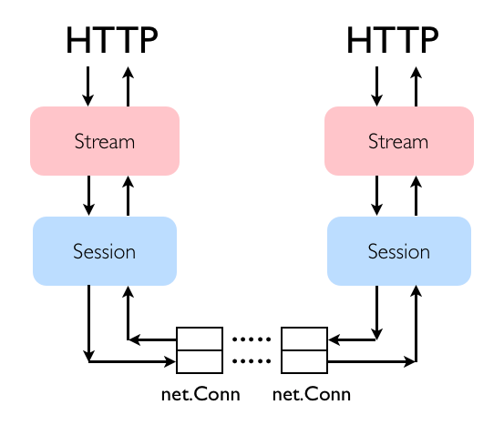

Amahi SPDY [](https://travis-ci.org/amahi/spdy) [](https://godoc.org/github.com/amahi/spdy) [](https://coveralls.io/r/amahi/spdy)
==========

Test coverage (v1.1): 72%

Amahi SPDY is a library built from scratch for building SPDY clients and servers in the Go programming language. It was meant to do it in a more "Go way" than other libraries available (which use mutexes liberally). Here is a high-level picture of how it's structured:


It supports a subset of [SPDY 3.1](http://www.chromium.org/spdy/spdy-protocol/spdy-protocol-draft3-1).

Check the online [documentation](http://godoc.org/github.com/amahi/spdy).

This library is used in a streaming server/proxy implementation for Amahi, the [home and media server](https://www.amahi.org).

Building a Server
========

```go
package main

import (
	"fmt"
	"github.com/amahi/spdy"
	"net/http"
)

func handler(w http.ResponseWriter, r *http.Request) {
	fmt.Fprintf(w, "Hi there, I love %s!", r.URL.Path[1:])
}

func main() {
	http.HandleFunc("/", handler)
	
	//use spdy's Listen and serve 
	err := spdy.ListenAndServe("localhost:4040",nil)
	if err != nil {
		//error handling here
	}
}
```

Building a Client
========

```go
package main

import (
	"fmt"
	"github.com/amahi/spdy"
	"io"
	"net/http"
)

func main() {
        //make a spdy client with a given address
	client, err := spdy.NewClient("localhost:4040")
	if err != nil {
		//handle error here
	}
	
	//make a request
	req, err := http.NewRequest("GET", "http://localhost:4040/banana", nil)
	if err != nil {
		//handle error here
	}
	
	//now send the request to obtain a http response
	res, err := client.Do(req)
	if err != nil {
		//something went wrong
	}
	
	//now handle the response
	data := make([]byte, int(res.ContentLength))
	_, err = res.Body.(io.Reader).Read(data)
	fmt.Println(string(data))
	res.Body.Close()
}
```
Examples
========

We have [several examples](examples) to help in getting aqcuainted to the Amahi SPDY package.

We also have a [reference implementation](https://github.com/amahi/spdy-proxy) of clients for the library, which contains an [origin server](https://github.com/amahi/spdy-proxy/blob/master/src/c/c.go), and a [proxy server](https://github.com/amahi/spdy-proxy/blob/master/src/p/p.go).

Architecture
============

The library is divided in `Session` objects and `Stream` objects as far as the external interface. Each Session and Stream may have multiple goroutines and channels to manage their structure and communication patterns. Here is an overview diagram of how the pieces fit together:


Each Session controls the communication between two net.Conn connected endpoints. Each Session has a server loop and in it there are two goroutines, one for sending frames from the network connection and one for receiving frames from it. These two goroutines are designed to never block. Except of course if there are network issues, which break the Session and all Streams in the Session.

Each Stream has a server and in it there are two goroutines, a Northbound Buffer Sender and a Control Flow Manager. The NorthBound Buffer Sender is in charge of writing data to the http response and causes control flow frames being sent southbound when data is written northbound. The Control Flow Manager is the owner of the control flow window size.

In the end there are two copies of these stacks, one on each side of the connection.



The goals for the library are reliability, streaming and performance/scalability.

1) Design for reliability means that network connections are assumed to disconnect at any time, especially when it's most inapropriate for the library to handle. This also includes potential issues with bugs in within the library, so the library tries to handle all crazy errors in the most reasonable way. A client or a server built with this library should be able to run for months and months of reliable operation. It's not there yet, but it will be.

2) Streaming requests, unlike typical HTTP requests (which are short), require working with an arbitrary large number of open requests (streams) simultaneously, and most of them are flow-constrained at the client endpoint. Streaming clients kind of misbehave too, for example, they open and close many streams rapidly with `Range` request to check certain parts of the file. This is common with endpoint clients like [VLC](https://videolan.org/vlc/) or [Quicktime](https://www.apple.com/quicktime/) (Safari on iOS or Mac OS X). We wrote this library with the goal of making it not just suitable for HTTP serving, but also for streaming.

3) The library was built with performance and scalability in mind, so things have been done using as little blocking and copying of data as possible. It was meant to be implemented in the "go way", using concurrency extensively and channel communication. The library uses mutexes very sparingly so that handling of errors at all manner of inapropriate times becomes easier. It goes to great lengths to not block, establishing timeouts when network and even channel communication may fail. The library should use very very little CPU, even in the presence of many streams and sessions running simultaneously.

This is not to say SPDY compliance/feature-completeness is not a priority. We're definitely interested in that, so that is an good area for contributions.


Testing
=======

The library needs more directed, white-box tests. Most of the testing has been black-box testing. It has been tested as follows:

1) Building a reference proxy and an origin server, exercising them with multiple streaming clients, stressing them with many streams in parallel.

2) The reference implementation above also contains some [integration tests](https://github.com/amahi/spdy-proxy/tree/master/integration-tests). These do not cover a lot in terms of stressing the library, but are a great baseline.

As such, the integration tests should be considered more like sanity checks. We're interested in contributions that cover more and more edge cases!

3) We periorically run apps built with this library, with the [Go race detector](http://blog.golang.org/race-detector) enabled. We no longer found any more race conditions.

We'd like to beef up the testing to make it scale!

Code Coverage
======

To get a detailed report of covered code:
```sh
 go test -coverprofile=coverage.out && go tool cover -html=coverage.out -o coverage.html
 ```
 
Spec Coverage
======

A document detailing parts of spdy spec covered by the Amahi SPDY library can be found in [docs/specs](docs/specs).
The document is labelled with the library version for which it is applicable. 

Status
======

Things implemented:
 * `SYN_STREAM`, `SYN_REPLY` and `RST_STREAM` frames
 * `WINDOW_UPDATE` and a (fixed) control flow window
 * `PING` frames
 * Support for other all types of HTTP requests
 * DATA frames, obviously
 * `GOAWAY` frame
 * NPN negotiation

Things to be implemented:
 * Support for SETTINGS frames
 * Actual implementation of priorities (everything is one priority at the moment)
 * Server push
 * HEADERS frames
 * Variable flow control window size
 * Extensive error handling for all possible rainy-day scenarios specified in the specification
 * Support for pre-3.1 SPDY standards

Contributing
============

* Fork it
* Make changes, test them
* Submit pull request!

Credits
=======

Credit goes to Jamie Hall for the patience and persistance to debug his excellent SPDY library that lead to the creation of this library.

The library was started from scratch, but some isolated code like the header compression comes from Jamie's library as well as other libraries out there that we used for inspiration. The header dictionary table comes from the SPDY spec definition.

The library has been extended by [Nilesh Jagnik](https://github.com/nileshjagnik) to support various new features along with the development of a Friendly API to create SPDY servers and clients.
